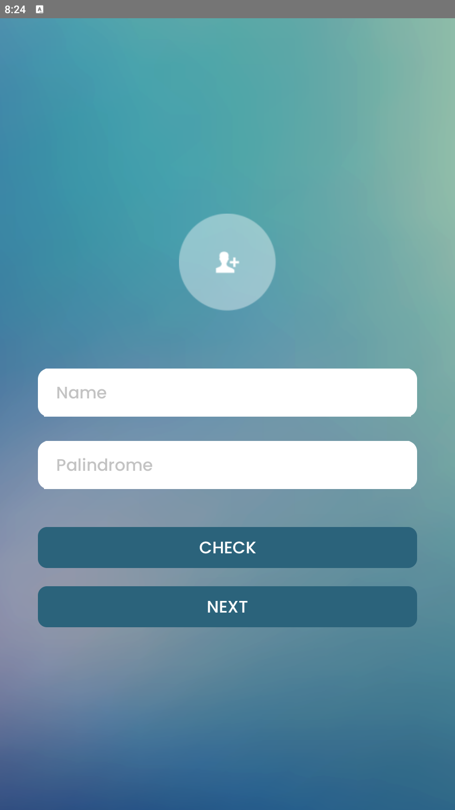
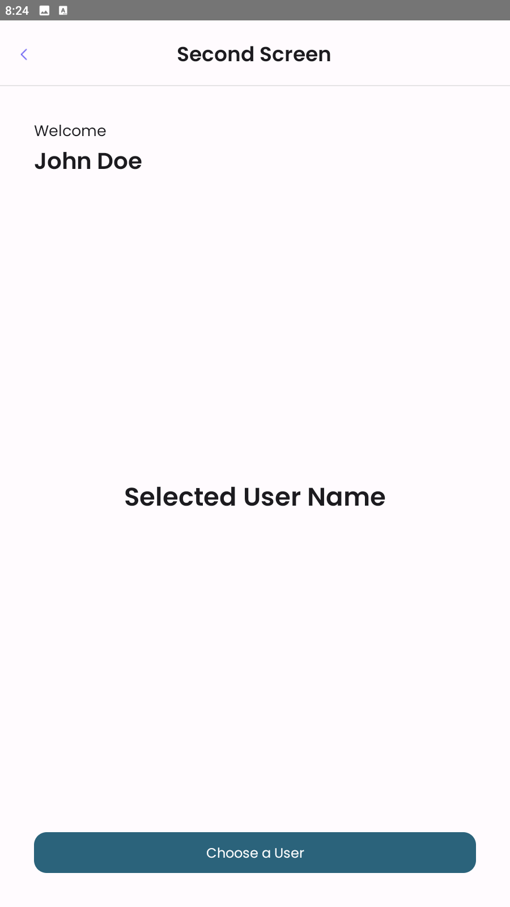
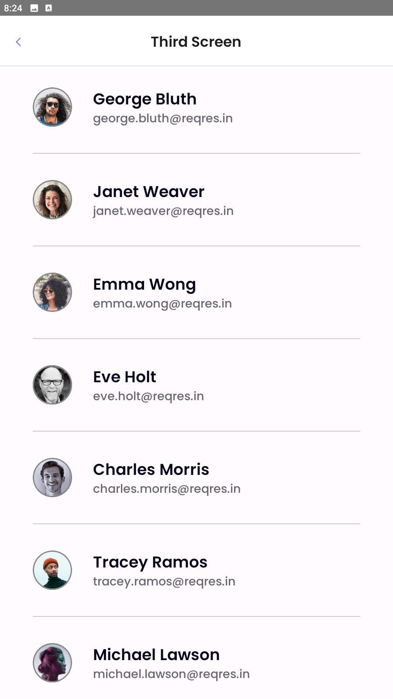

 # Suitmedia App

Suitmedia App is a sample Android application built using Jetpack Compose. This application was created as a test for a mobile developer intern position at Suitmedia. The app demonstrates the use of modern Android development practices, including MVVM architecture, Retrofit for network requests, and Compose for UI.

## Features

This application has 3 screens:

### First Screen

- It has two input texts and two buttons.
- One input text for name input and the other for input sentence text, to check whether the sentence is a palindrome or not.

  Examples:
  - `isPalindrome("kasur rusak")` -> true
  - `isPalindrome("step on no pets")` -> true
  - `isPalindrome("put it up")` -> true
  - `isPalindrome("suitmedia")` -> false

- A button with a “Check” title below the input texts.
- Shows a dialog with the message “isPalindrome” if it’s a palindrome and the message “not palindrome” if it’s not a palindrome when clicking the Check button.
- A button with a “Next” title below the Check button.
- Navigates to the Second Screen when clicking the Next button.

### Second Screen

- It has a static “Welcome” text label.
- It has two dynamic labels for showing the name from the first screen and the selected user's name.
- It has a button “Choose a User”.
- Clicking the “Choose a User” button navigates to the Third Screen.

### Third Screen

- It has a list/table view of users.
- Collects data from the regres.in API with email, first_name, last_name, and avatar.
- Adds a pull-to-refresh and loads the next page when scrolling to the bottom of the list. Prepares an empty state if data is empty. You can use the API with parameters `page` and `per_page` to get the next page data.
- When a user on the item list is clicked, the selected user's name label in the Second Screen will be replaced by the selected user's name (without creating a new screen, just continue the current screen).

## Screenshots

  

## Architecture

The app follows the MVVM (Model-View-ViewModel) architecture pattern, which helps in separating the concerns of the application and makes the code more maintainable and testable.

## Libraries Used

- **Jetpack Compose**: For building the UI.
- **Retrofit**: For making network requests.
- **Coil**: For loading images.
- **Kotlin Coroutines**: For asynchronous programming.
- **Navigation Component**: For handling navigation between screens.

## Getting Started

### Prerequisites

- Android Studio Ladybug
- Gradle 8.0 or later

### Installation

1. Clone the repository:
    ```sh
    git clone https://github.com/Suryy16/suitmedia-app.git
    ```
2. Open the project in Android Studio.
3. Build the project to download the necessary dependencies.

### Running the App

1. Connect an Android device or start an emulator.
2. Click on the "Run" button in Android Studio or use the following command:
    ```sh
    ./gradlew installDebug
    ```

## Project Structure

- **MainActivity.kt**: The main entry point of the app.
- **ui/screens**: Contains the Compose UI screens (FirstScreen.kt, SecondScreen.kt, ThirdScreen.kt).
- **viewmodel**: Contains the UserViewModel.kt for managing UI-related data.
- **repository**: Contains the UserRepository.kt for handling data operations.
- **data/api**: Contains the Retrofit API client and service (ApiClient.kt, ApiService.kt).
- **model**: Contains the data models (User.kt).

## API

The app uses the Reqres API to fetch user data.

## License

This project is licensed under the MIT License. See the LICENSE file for more details.

## Acknowledgements

- Jetpack Compose
- Retrofit
- Coil

## Contact

For any inquiries, please contact [Suryy16](https://github.com/Suryy16)..

Feel free to customize this README file according to your project's specific details and requirements.
